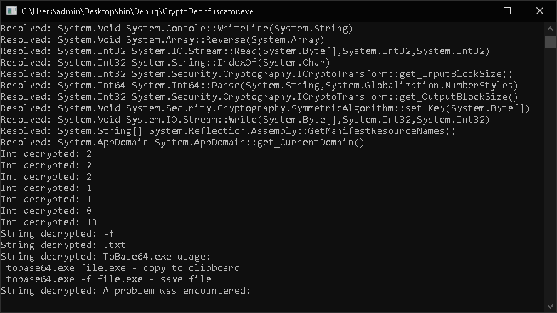
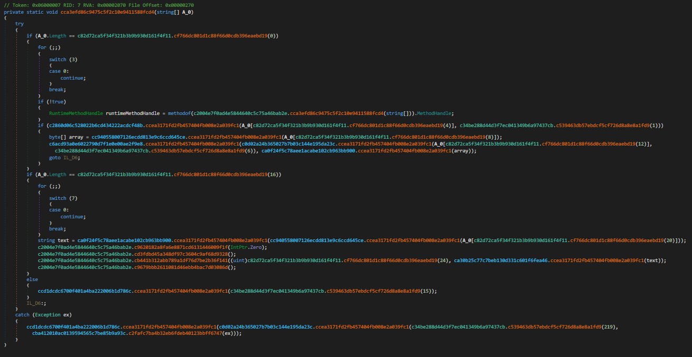
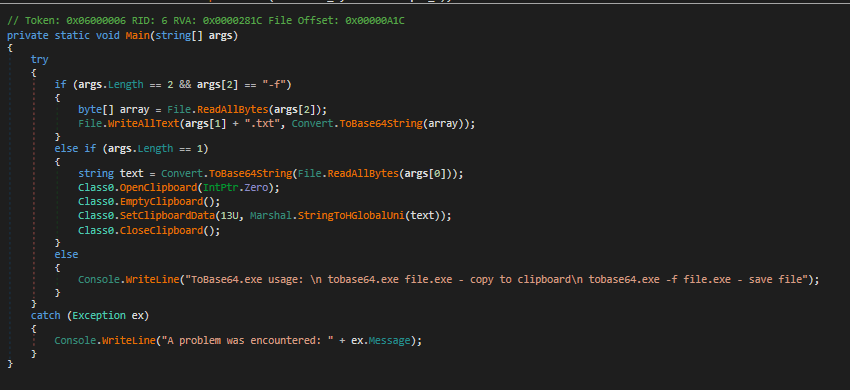

# CryptoDeobfuscator
A basic semi-static deobfuscator for CryptoObfuscator 2020 enterprise. Resolves hidden calls & decrypts constants.

    </img>
    <text>CryptoObfuscator</text>

 

    </img>
    <text>Progress</text>

 

    </img>
    <text>Before</text>

 

    </img>
    <text>After (CryptoDeobfuscator + De4dot)</text>

